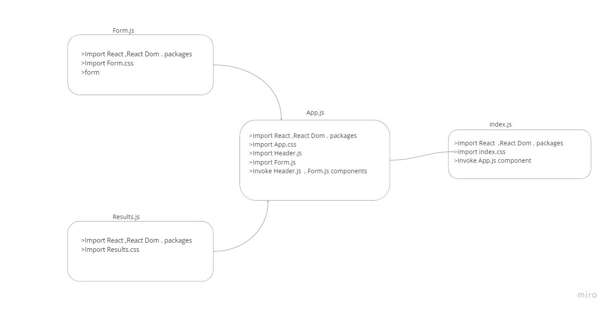

# Resty  
***A browser based API testing tool***  
Our application will be an API testing tool that can be run in any browser, allowing a user to easily interact with APIs in a familiar interface.  

# PR  
[PR](https://github.com/Oubaida996/resty/pull/1)  

# netlify  
[netlify](https://6269a7141c9ee60059477dac--warm-hotteok-09251b.netlify.app/)  
[API LINK](https://reqres.in/api/users)  

## for test  

body  
  

    "name": "obieda",  
    "job": "leader"

# UML  
  

# Phase 1 Requirements 
 In this first phase, our goal is to setup the basic scaffolding of the application, with intent being to add more functionality to the system as we go. This initial build sets up the file structure so that we can progressively build this application in a scalable manner.  
 
 # Phase 2 Requirements 
Extend your React Application so that your functional components are able to manage their own state variables using the useState Hook.
NOTE: It is not a requirement to make the actual API call. That can be mocked with “fake” data

Refactor any components using this.setState to implement the useState react API hook.
Refactor the Form Component to implement user input from form elements, instead of hard coded string values.
